```mermaid
flowchart LR
    Arow["Row i of A"] -->|dot product| Bcol["Column j of B"]
    Bcol --> Cij["Element C₍ᵢⱼ₎"]
```

# Lecture 3: Multiplication and Inverse

**Video Lecture**: [MIT 18.06 Lecture 3 - Multiplication and Inverse Matrices](https://www.youtube.com/watch?v=FX4C-JpTFgY&list=PL221E2BBF13BECF6C&index=9)

Gilbert Strang — MIT 18.06 Linear Algebra
**Topic:** Multiple ways to understand **matrix multiplication** and **matrix inverse**

---

## 🧩 1. Element-by-Element View

Each entry of $C = AB$ is computed by **row × column** multiplication:

$$
C_{ij} = \sum_{k=1}^n A_{ik} B_{kj}
$$

**Example:**
$$
\begin{bmatrix} 1 & 2 \\ 3 & 4 \end{bmatrix}
\begin{bmatrix} 5 & 6 \\ 7 & 8 \end{bmatrix}
=
\begin{bmatrix} 1·5+2·7 & 1·6+2·8 \\ 3·5+4·7 & 3·6+4·8 \end{bmatrix}
=
\begin{bmatrix} 19 & 22 \\ 43 & 50 \end{bmatrix}
$$

---

## 📊 2. Column View

**Key insight:** Each column of $C$ is a linear combination of columns of $A$.

$$
C = A \begin{bmatrix} | & | & & | \\ b_1 & b_2 & \cdots & b_p \\ | & | & & | \end{bmatrix}
= \begin{bmatrix} | & | & & | \\ Ab_1 & Ab_2 & \cdots & Ab_p \\ | & | & & | \end{bmatrix}
$$

```mermaid
flowchart TB
    B["Matrix B"] --> col1["Column 1 of B"]
    B --> col2["Column 2 of B"]
    A["Matrix A"] --> mult1["A × col1"]
    A --> mult2["A × col2"]
    mult1 --> C1["Column 1 of C"]
    mult2 --> C2["Column 2 of C"]
```

**Interpretation:** Multiplying $A$ by each column of $B$ produces each column of $C$.

---

## 📈 3. Row View

**Key insight:** Each row of $C$ is a linear combination of rows of $B$.

$$
C = \begin{bmatrix} — & a_1 & — \\ — & a_2 & — \\ & \vdots & \\ — & a_m & — \end{bmatrix} B
= \begin{bmatrix} — & a_1B & — \\ — & a_2B & — \\ & \vdots & \\ — & a_mB & — \end{bmatrix}
$$

**Interpretation:** Each row of $A$ multiplies the entire matrix $B$ to produce a row of $C$.

---

## 🎯 4. Column × Row View (Rank-1 Matrices)

This is the most powerful view for understanding matrix multiplication:

$$
AB = \sum_{k=1}^n (\text{column } k \text{ of } A) \times (\text{row } k \text{ of } B)
$$

Each term is a **rank-1 matrix** (outer product).

```mermaid
flowchart LR
    A["Matrix A"] --> col["Column k of A<br/>(m×1)"]
    B["Matrix B"] --> row["Row k of B<br/>(1×p)"]
    col --> outer["Outer Product<br/>(m×p rank-1 matrix)"]
    row --> outer
    outer --> sum["Sum all k terms<br/>= Matrix C"]
```

**Example:**
$$
\begin{bmatrix} 1 & 2 \\ 3 & 4 \end{bmatrix}
\begin{bmatrix} 5 & 6 \\ 7 & 8 \end{bmatrix}
=
\begin{bmatrix} 1 \\ 3 \end{bmatrix}
\begin{bmatrix} 5 & 6 \end{bmatrix}
+
\begin{bmatrix} 2 \\ 4 \end{bmatrix}
\begin{bmatrix} 7 & 8 \end{bmatrix}
$$

$$
=
\begin{bmatrix} 5 & 6 \\ 15 & 18 \end{bmatrix}
+
\begin{bmatrix} 14 & 16 \\ 28 & 32 \end{bmatrix}
=
\begin{bmatrix} 19 & 22 \\ 43 & 50 \end{bmatrix}
$$

---

## 🔄 5. Block Multiplication

Matrices can be partitioned into blocks and multiplied block-wise:

$$
\begin{bmatrix} A_1 & A_2 \\ A_3 & A_4 \end{bmatrix}
\begin{bmatrix} B_1 & B_2 \\ B_3 & B_4 \end{bmatrix}
=
\begin{bmatrix} A_1B_1 + A_2B_3 & A_1B_2 + A_2B_4 \\ A_3B_1 + A_4B_3 & A_3B_2 + A_4B_4 \end{bmatrix}
$$

**Condition:** Block dimensions must be compatible for multiplication.

---

## 🔁 Matrix Inverse

### Definition

If $A$ is **square** and **invertible**, there exists a matrix $A^{-1}$ such that:

$$
A^{-1}A = I \quad \text{and} \quad AA^{-1} = I
$$

where $I$ is the identity matrix.

### Properties

1. **Not all matrices are invertible**
   - Singular matrices (det = 0) have no inverse
   - Non-square matrices have no inverse

2. **If $A$ is invertible:**
   - $(A^{-1})^{-1} = A$

### When does $A^{-1}$ NOT exist?

1. **Zero determinant:** $\det(A) = 0$
2. **Columns are dependent:** Some column is a combination of others
3. **$Ax = 0$ for non-zero $x$:** Null space is non-trivial

### Example: Why Singular Matrices Have No Inverse

Consider the singular matrix:

$$
A = \begin{bmatrix} 1 & 2 \\ 2 & 4 \end{bmatrix}
$$

**Observation:** The second column is 2× the first column (columns are dependent).

We can find a non-zero vector $x = \begin{bmatrix} 2 \\ -1 \end{bmatrix}$ such that:

$$
Ax = \begin{bmatrix} 1 & 2 \\ 2 & 4 \end{bmatrix} \begin{bmatrix} 2 \\ -1 \end{bmatrix} = \begin{bmatrix} 2-2 \\ 4-4 \end{bmatrix} = \begin{bmatrix} 0 \\ 0 \end{bmatrix}
$$

**Proof by contradiction that $A^{-1}$ cannot exist:**

Suppose $A^{-1}$ exists. Then:
- We have $Ax = 0$ where $x = \begin{bmatrix} 2 \\ -1 \end{bmatrix} \neq 0$
- Multiply both sides by $A^{-1}$: $A^{-1}(Ax) = A^{-1} \cdot 0$
- Left side: $A^{-1}(Ax) = (A^{-1}A)x = Ix = x$
- Right side: $A^{-1} \cdot 0 = 0$
- Therefore: $x = 0$

**Contradiction!** We know $x = \begin{bmatrix} 2 \\ -1 \end{bmatrix} \neq 0$, but our logic says $x = 0$.

This contradiction proves that $A^{-1}$ cannot exist.

### Computing the Inverse

For a $2 \times 2$ matrix:

$$
A = \begin{bmatrix} a & b \\ c & d \end{bmatrix}
\quad \Rightarrow \quad
A^{-1} = \frac{1}{ad-bc} \begin{bmatrix} d & -b \\ -c & a \end{bmatrix}
$$

**Note:** $ad - bc$ is the determinant. If $\det(A) = 0$, no inverse exists.

For larger matrices, use **Gauss-Jordan elimination**:
$$
[A | I] \xrightarrow{\text{row operations}} [I | A^{-1}]
$$

---

## 🎓 Key Takeaways

1. **Five ways to view matrix multiplication:**
   - Element-by-element (row × column)
   - Columns of $C$ = combinations of columns of $A$
   - Rows of $C$ = combinations of rows of $B$
   - Sum of column × row (rank-1 matrices)
   - Block multiplication

2. **Matrix inverse:**
   - Only square matrices can have inverses
   - Inverse exists ⟺ determinant ≠ 0

3. **Practical importance:**
   - Solving $Ax = b$: if $A^{-1}$ exists, then $x = A^{-1}b$
   - However, computing $A^{-1}$ directly is often inefficient
   - Gauss elimination is usually better than computing inverse

---

## 📝 Practice Problems

1. Compute $AB$ using all four perspectives (element, column, row, rank-1)
2. Find the inverse of $\begin{bmatrix} 2 & 1 \\ 5 & 3 \end{bmatrix}$
3. Explain why a matrix with dependent columns cannot have an inverse
4. Verify that the matrix $\begin{bmatrix} 1 & 2 \\ 2 & 4 \end{bmatrix}$ has no inverse
