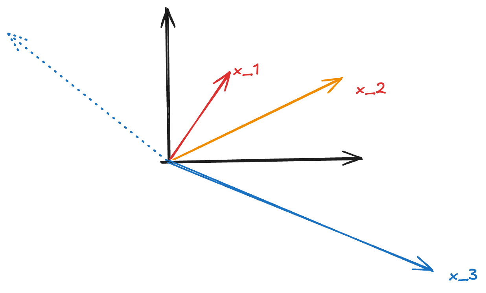
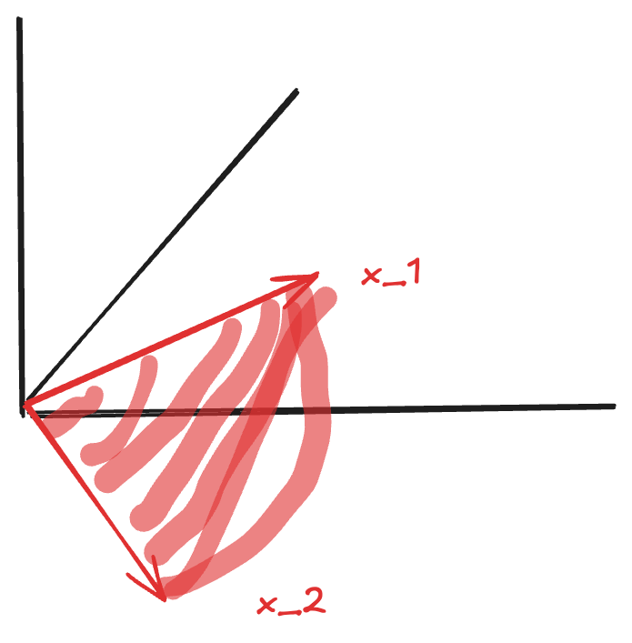

# Lecture 9: Independence, Basis, and Dimension

**Video Lecture**: [MIT 18.06 Lecture 9 - Linear Independence, Basis, and Dimension](https://www.youtube.com/watch?v=yjBerM5jWsc&list=PL221E2BBF13BECF6C&index=21)

## Linear Independence

### Definition

Vectors $x_1, x_2, \ldots, x_n$ are **linearly independent** if the only linear combination that produces the zero vector is the trivial combination (all coefficients zero):

$$
c_1x_1 + c_2x_2 + \cdots + c_nx_n = 0 \quad \Rightarrow \quad c_1 = c_2 = \cdots = c_n = 0
$$

Equivalently, vectors are **dependent** if there exists a non-trivial combination (some $c_i \neq 0$) that gives zero:

$$
c_1x_1 + c_2x_2 + \cdots + c_nx_n = 0 \quad \text{with some } c_i \neq 0
$$

### When Are Vectors Dependent?

**Case 1: Zero vector present**

If one of the vectors is $\vec{0}$, the vectors are automatically dependent:
$$
r \cdot \vec{0} + 0 \cdot x_1 + \cdots + 0 \cdot x_n = 0 \quad \text{(non-trivial combination)}
$$

**Case 2: More vectors than dimensions ($n > m$)**

If we have $n$ vectors in $\mathbb{R}^m$ with $n > m$, and the first $m$ vectors are linearly independent (not collinear/coplanar), then all $n$ vectors must be dependent.

**Example in $\mathbb{R}^2$**: Consider three vectors $x_1, x_2, x_3$ in the plane where $x_1$ and $x_2$ are not collinear.

- Since $x_1$ and $x_2$ are linearly independent, their combinations $c_1x_1 + c_2x_2$ span the entire plane
- Therefore, $x_3$ can be expressed as some combination of $x_1$ and $x_2$
- This means we can find $c_1, c_2$ such that $c_1x_1 + c_2x_2 = x_3$
- Rearranging: $c_1x_1 + c_2x_2 - x_3 = 0$ (a non-trivial combination equals zero)
- Thus $x_1, x_2, x_3$ are dependent

### Null Space Interpretation

To test independence of vectors $v_1, v_2, \ldots, v_n$, form the matrix:
$$
A = [v_1 \mid v_2 \mid \cdots \mid v_n]
$$

The equation $c_1v_1 + c_2v_2 + \cdots + c_nv_n = 0$ becomes $Ax = 0$ where $x = \begin{bmatrix} c_1 \\ c_2 \\ \vdots \\ c_n \end{bmatrix}$.

**Vectors are independent** if and only if:
- $N(A) = \{\vec{0}\}$ (null space contains only zero vector)
- $\text{rank}(A) = n$ (full column rank)
- No free variables

**Vectors are dependent** if and only if:
- $N(A)$ contains non-zero vectors
- $\text{rank}(A) < n$ (rank deficient)
- Has free variables ($n - r > 0$)

**Example**: For 3 vectors in $\mathbb{R}^2$ (underdetermined system with $m = 2 < n = 3$):
- We have $r = 2 = m < n = 3$
- Number of free variables: $n - r = 3 - 2 = 1$
- $N(A)$ has infinitely many solutions
- Therefore, the vectors are dependent

## Spanning Sets

### Definition

Vectors $v_1, v_2, \ldots, v_l$ **span** a space $S$ if every vector in $S$ can be written as a linear combination of $v_1, \ldots, v_l$:

$$
S = \text{span}(v_1, \ldots, v_l) = \{c_1v_1 + c_2v_2 + \cdots + c_lv_l \mid c_i \in \mathbb{R}\}
$$

**Interpretation**: The span is the set of all possible linear combinations of the vectors.

## Basis

### Definition

A **basis** for a vector space $S$ is a sequence of vectors $v_1, v_2, \ldots, v_n$ that satisfies **two properties**:

1. **Independence**: The vectors are linearly independent
   - Ensures no redundancy (can't remove any vector)
   - Rank = number of vectors

2. **Spanning**: The vectors span the space $S$
   - Every vector in $S$ can be expressed as a combination
   - Rank = dimension of space

**Key insight**: A basis is a minimal spanning set (independent) and a maximal independent set (spanning).

### Standard Basis for $\mathbb{R}^n$

For the space $\mathbb{R}^n$, the standard basis consists of $n$ vectors.

**Example in $\mathbb{R}^3$**:
$$
\begin{bmatrix} 1 \\ 0 \\ 0 \end{bmatrix}, \quad
\begin{bmatrix} 0 \\ 1 \\ 0 \end{bmatrix}, \quad
\begin{bmatrix} 0 \\ 0 \\ 1 \end{bmatrix}
$$

These are the columns of the identity matrix $I_3$.

### Properties of Bases

1. **Every vector has a unique representation**: If $\{v_1, \ldots, v_n\}$ is a basis for $S$, then every $x \in S$ can be written uniquely as:
   $$
   x = c_1v_1 + c_2v_2 + \cdots + c_nv_n
   $$

2. **All bases have the same size**: Any two bases for the same space have the same number of vectors (this number is the dimension)

3. **Basis matrix is invertible**: If we form a matrix $B = [v_1 \mid \cdots \mid v_n]$ where $\{v_1, \ldots, v_n\}$ is a basis for $\mathbb{R}^n$, then $B$ is square ($n \times n$) and invertible

## Dimension

### Definition

The **dimension** of a vector space $S$ is the number of vectors in any basis for $S$.

**Notation**: $\dim(S)$

### Dimension Formulas

For an $m \times n$ matrix $A$ with rank $r$:

1. **Dimension of column space**:
   $$
   \dim(C(A)) = r
   $$
   The pivot columns form a basis for $C(A)$.

2. **Dimension of null space** (also called **nullity**):
   $$
   \dim(N(A)) = n - r
   $$
   The number of special solutions equals the number of free variables.

3. **Rank-Nullity Theorem**:
   $$
   \dim(C(A)) + \dim(N(A)) = n
   $$
   or equivalently:
   $$
   r + (n - r) = n
   $$

### Examples

**Example 1**: Matrix with full column rank
$$
A = \begin{bmatrix} 1 & 0 \\ 2 & 1 \\ 3 & 2 \end{bmatrix}, \quad r = 2, \, m = 3, \, n = 2
$$

- $\dim(C(A)) = 2$ (columns are independent, they form a basis)
- $\dim(N(A)) = n - r = 2 - 2 = 0$ (only zero vector in null space)

**Example 2**: Rank-deficient matrix
$$
A = \begin{bmatrix} 1 & 2 & 3 \\ 2 & 4 & 6 \end{bmatrix}, \quad r = 1, \, m = 2, \, n = 3
$$

- $\dim(C(A)) = 1$ (only one independent column)
- $\dim(N(A)) = n - r = 3 - 1 = 2$ (2-dimensional null space)

## Summary

| Concept | Definition | Test |
|---------|-----------|------|
| **Independence** | No non-trivial combination gives zero | $N(A) = \{\vec{0}\}$ or $r = n$ |
| **Spanning** | All vectors in space are combinations | $C(A) = S$ or $r = \dim(S)$ |
| **Basis** | Independent + Spanning | $r = n = \dim(S)$ |
| **Dimension** | Number of vectors in basis | $\dim(C(A)) = r$, $\dim(N(A)) = n - r$ |

**Key relationships**:
- Independence prevents redundancy (no vector is a combination of others)
- Spanning ensures completeness (every vector in the space is reachable)
- Basis achieves both: minimal spanning set = maximal independent set
- Dimension is the fundamental measure of "size" of a vector space
