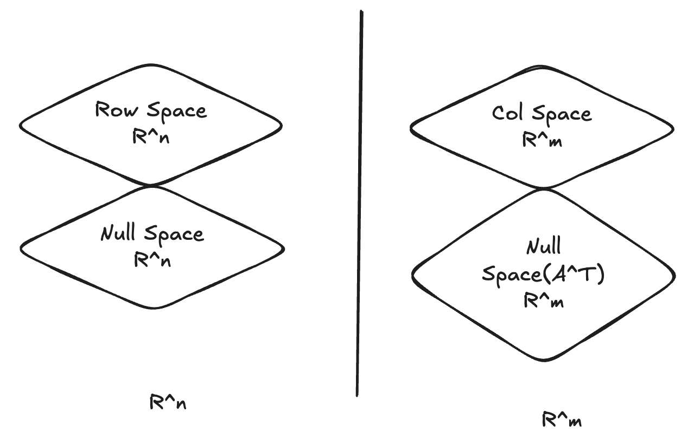

# Lecture 10: Four Fundamental Subspaces

**Video Lecture**: [MIT 18.06 Lecture 10 - Four Fundamental Subspaces](https://www.youtube.com/watch?v=nHlE7EgJFds&list=PL221E2BBF13BECF6C&index=23)

## Overview

For any $m \times n$ matrix $A$, there are **four fundamental subspaces** that completely characterize its structure:

| Subspace | Notation | Lives in | Dimension | Solves |
|----------|----------|----------|-----------|--------|
| **Column Space** | $C(A)$ | $\mathbb{R}^m$ | $r$ | $Ax = b$ |
| **Null Space** | $N(A)$ | $\mathbb{R}^n$ | $n - r$ | $Ax = \mathbf{0}$ |
| **Row Space** | $C(A^T)$ | $\mathbb{R}^n$ | $r$ | $A^T y = c$ |
| **Left Null Space** | $N(A^T)$ | $\mathbb{R}^m$ | $m - r$ | $A^T y = \mathbf{0}$ |

where $r = \text{rank}(A)$.

---

## 1. Column Space: $C(A)$

**Definition**: The span of all columns of $A$.

**Properties**:
- Lives in $\mathbb{R}^m$ (same dimension as the rows)
- Dimension = $\text{rank}(A) = r$
- Represents all possible outputs of $Ax$

**Linear combination interpretation**:
$$
x_1 A_{:,1} + x_2 A_{:,2} + \cdots + x_n A_{:,n} = b
$$

**Key question**: For which $b$ does $Ax = b$ have a solution?
**Answer**: When $b \in C(A)$ (when $b$ is in the column space).

---

## 2. Null Space: $N(A)$

**Definition**: All vectors $x$ such that $Ax = \mathbf{0}$.

**Properties**:
- Lives in $\mathbb{R}^n$ (same dimension as the columns)
- Dimension = $n - r$ (number of free variables)
- Contains all solutions to the homogeneous system $Ax = \mathbf{0}$

**Interpretation**: Vectors that get "killed" by the matrix $A$.

---

## 3. Row Space: $C(A^T)$

**Definition**: The span of all rows of $A$, equivalently the column space of $A^T$.

**Properties**:
- Lives in $\mathbb{R}^n$ (same dimension as the columns)
- Dimension = $\text{rank}(A) = r$ (same as column space)
- Represents all possible outputs of $A^T y$

**Key insight**: Row rank equals column rank (both equal $r$).

---

## 4. Left Null Space: $N(A^T)$

**Definition**: All vectors $y$ such that $A^T y = \mathbf{0}$.

**Properties**:
- Lives in $\mathbb{R}^m$ (same dimension as the rows)
- Dimension = $m - r$
- Also called the **left null space** of $A$

**Why "left null space"?**

Starting from $A^T y = \mathbf{0}$:
$$
\begin{aligned}
A^T y &= \mathbf{0} \\
(A^T y)^T &= \mathbf{0}^T = [\mathbf{0}] \\
y^T A &= [\mathbf{0}]
\end{aligned}
$$

Since $y^T$ is $1 \times m$ and appears on the **left** of $A$, this is called the **left null space**.

---

## RREF and the Four Subspaces

### Example Matrix

$$
A = \begin{bmatrix}
1 & 2 & 3 & 4 \\
5 & 6 & 7 & 8 \\
2 & 4 & 6 & 8
\end{bmatrix}
$$

### Row Echelon Form (REF)

$$
\text{REF} = \begin{bmatrix}
1 & 2 & 3 & 4 \\
0 & -4 & -8 & -12 \\
0 & 0 & 0 & 0
\end{bmatrix}
$$

### Reduced Row Echelon Form (RREF)

**Step 1**: Normalize pivot rows
$$
\begin{bmatrix}
1 & 2 & 3 & 4 \\
0 & 1 & 2 & 3 \\
0 & 0 & 0 & 0
\end{bmatrix}
$$

**Step 2**: Eliminate above pivots
$$
\text{RREF} = \begin{bmatrix}
1 & 0 & -1 & -2 \\
0 & 1 & 2 & 3 \\
0 & 0 & 0 & 0
\end{bmatrix}
$$

### Analysis

- **Rank**: $r = 2$ (two pivot columns)
- **Free variables**: $n - r = 4 - 2 = 2$ (columns 3 and 4)
- **Dimension of $N(A)$**: $n - r = 2$
- **Dimension of $C(A)$**: $r = 2$
- **Dimension of $C(A^T)$**: $r = 2$
- **Dimension of $N(A^T)$**: $m - r = 3 - 2 = 1$

**Key observation**: RREF is the unique simplest form of a matrix obtained through row operations that preserve the solution space.

---

## Visualization

---

## Dimension Relationships

**For an $m \times n$ matrix $A$ with rank $r$:**

### In $\mathbb{R}^n$:
- $\dim(C(A^T)) + \dim(N(A)) = r + (n - r) = n$
- Row space and null space partition $\mathbb{R}^n$

### In $\mathbb{R}^m$:
- $\dim(C(A)) + \dim(N(A^T)) = r + (m - r) = m$
- Column space and left null space partition $\mathbb{R}^m$

**Key insight**: The four subspaces come in complementary pairs that completely partition their ambient spaces.

---

## Summary

**The four fundamental subspaces:**
1. **Column space** $C(A)$: where outputs $Ax$ live
2. **Null space** $N(A)$: inputs that map to zero
3. **Row space** $C(A^T)$: perpendicular complement to null space in $\mathbb{R}^n$
4. **Left null space** $N(A^T)$: perpendicular complement to column space in $\mathbb{R}^m$

**Dimension formula**:
- $\dim(C(A)) = \dim(C(A^T)) = r$
- $\dim(N(A)) = n - r$
- $\dim(N(A^T)) = m - r$

**Total check**: $r + (n-r) = n$ and $r + (m-r) = m$

---

*Source: MIT 18.06SC Linear Algebra, Lecture 10*
