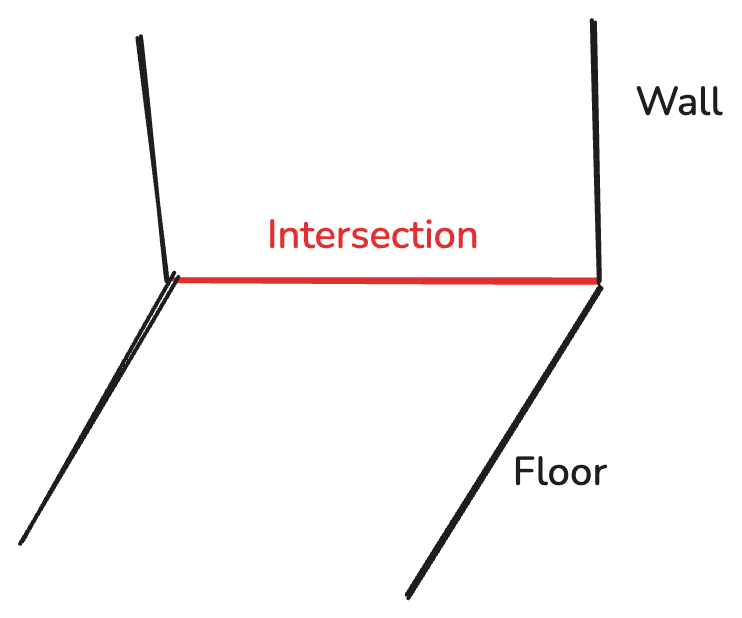
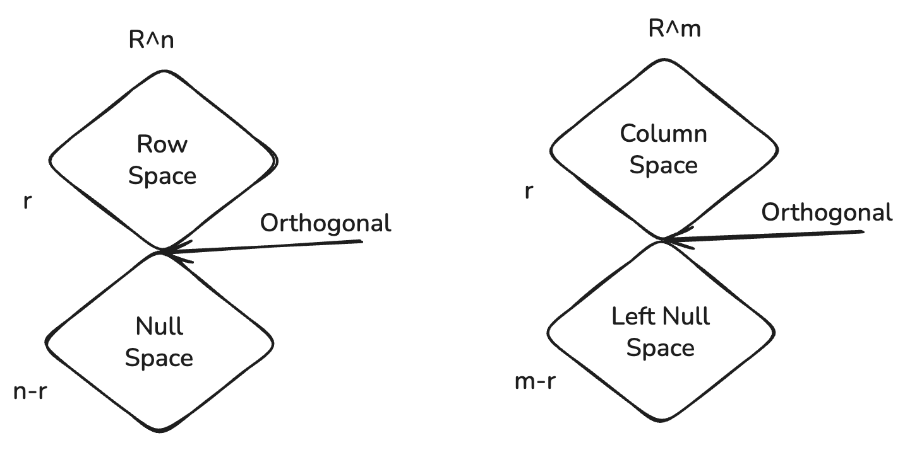

# Lecture 14: Orthogonality

**Video Lecture**: [MIT 18.06 Lecture 14 - Orthogonal Vectors and Subspaces](https://www.youtube.com/watch?v=YzZUIYRCE38&list=PL221E2BBF13BECF6C&index=30)

**Reference**: [Four Fundamental Subspaces](https://ickma2311.github.io/Math/MIT18.06/mit1806-lecture10-four-subspaces.html)

---

## 1. Orthogonal Vectors

**Definition**: In $n$-dimensional space, two vectors are orthogonal if the angle between them is $90°$.

**Mathematical condition**:

$$
x^T y = 0
$$

**Interpretation**: The dot product (inner product) of orthogonal vectors equals zero.

---

### Pythagorean Theorem in Vector Spaces

**Classical form**:

$$
\|a\|^2 + \|b\|^2 = \|c\|^2
$$

**Vector space form**: For orthogonal vectors $x$ and $y$ (where $x^T y = 0$):

$$
\|x\|^2 + \|y\|^2 = \|x + y\|^2
$$

**Proof**:

$$
\begin{aligned}
\|x + y\|^2 &= (x + y)^T(x + y) \\
&= x^T x + x^T y + y^T x + y^T y \\
&= \|x\|^2 + 2(x^T y) + \|y\|^2 \\
&= \|x\|^2 + \|y\|^2
\end{aligned}
$$

The cross terms vanish because $x^T y = 0$ (orthogonality condition).

---

### Vector Norm Squared

**Definition**:

$$
\|x\|^2 = x^T \cdot x = \sum_{i=1}^n x_i^2
$$

**Interpretation**: The squared length (magnitude) of a vector equals the sum of squares of its components.

---

## 2. Orthogonal Subspaces

**Definition**: Subspace $S$ is orthogonal to subspace $T$ if every vector in $S$ is orthogonal to every vector in $T$.

**Mathematical statement**:

$$
S \perp T \iff \text{for all } s \in S \text{ and } t \in T, \quad s^T t = 0
$$

---

### Example: Are Wall and Floor Orthogonal Subspaces?

**Question**: In 3D space, is the wall (a 2D subspace) orthogonal to the floor (another 2D subspace)?

**Answer**: No, for two reasons:

**Reason 1 (Intersection)**:
- Their intersection is a line, not just the origin
- Vectors along this line are in both subspaces
- A vector cannot be orthogonal to itself (unless it's zero)
- Therefore, not all vectors in one are orthogonal to all vectors in the other

**Reason 2 (Dimension)**:
- Wall has dimension 2
- Floor has dimension 2
- The whole space has dimension 3
- For orthogonal subspaces: $\dim(S) + \dim(T) \leq \dim(\text{space})$
- Here: $2 + 2 = 4 > 3$ (impossible!)

**Key insight**: Orthogonal subspaces can only intersect at the origin.

---

## 3. Row Space and Null Space

**Theorem**: The null space $N(A)$ contains all vectors perpendicular to the row space $C(A^T)$.

**Proof**: For any $x \in N(A)$ and any row $r_i$ of $A$:

$$
Ax = \mathbf{0} \implies r_i^T x = 0 \text{ for all rows } r_i
$$

Therefore $x$ is orthogonal to every row, hence orthogonal to the entire row space.

**Direct sum decomposition**:

$$
\mathbb{R}^n = C(A^T) \oplus N(A)
$$

**Interpretation**:
- Every vector in $\mathbb{R}^n$ can be uniquely decomposed into a row space component and a null space component
- These two subspaces are orthogonal complements
- $\dim(C(A^T)) + \dim(N(A)) = n$

---

## 4. Column Space and Left Null Space

**Theorem**: The left null space $N(A^T)$ contains all vectors perpendicular to the column space $C(A)$.

**Proof**: For any $y \in N(A^T)$:

$$
A^T y = \mathbf{0} \implies y^T A = \mathbf{0}^T
$$

This means $y$ is orthogonal to every column of $A$.

**Direct sum decomposition**:

$$
\mathbb{R}^m = C(A) \oplus N(A^T)
$$

**Interpretation**:
- Every vector in $\mathbb{R}^m$ can be uniquely decomposed into a column space component and a left null space component
- These two subspaces are orthogonal complements
- $\dim(C(A)) + \dim(N(A^T)) = m$

---

## 5. Orthogonality and the Least Squares Problem

### When There's No Exact Solution

**Problem**: For $Ax = b$ where $m > n$, there's typically no exact solution.

**Solution**: Find the best approximate solution $\hat{x}$ that minimizes $\|Ax - b\|^2$.

---

### Normal Equations

**Approximate solution**:

$$
A^T A\hat{x} = A^T b
$$

**Note**: The derivation of $\hat{x}$ and why this works will be introduced in Lecture 15.

---

### Properties of $A^T A$

**Null space relationship**:

$$
N(A^T A) = N(A)
$$

**Proof**:
- If $Ax = \mathbf{0}$, then $A^T Ax = \mathbf{0}$
- Conversely, if $A^T Ax = \mathbf{0}$, then $x^T A^T Ax = \|Ax\|^2 = 0 \implies Ax = \mathbf{0}$

**Rank relationship**:

$$
\operatorname{rank}(A^T A) = \operatorname{rank}(A)
$$

**Invertibility**: $A^T A$ is invertible when $\operatorname{rank}(A) = n$ (full column rank).

**When full column rank**:

$$
\hat{x} = (A^T A)^{-1} A^T b
$$

---

## Summary of Orthogonal Complements

| Space in $\mathbb{R}^n$ | Orthogonal Complement | Total Dimension |
|------------------------|----------------------|-----------------|
| Row space $C(A^T)$ | Null space $N(A)$ | $r + (n-r) = n$ |

| Space in $\mathbb{R}^m$ | Orthogonal Complement | Total Dimension |
|------------------------|----------------------|-----------------|
| Column space $C(A)$ | Left null space $N(A^T)$ | $r + (m-r) = m$ |

**Key relationships**:
1. $C(A^T) \perp N(A)$ and they span $\mathbb{R}^n$
2. $C(A) \perp N(A^T)$ and they span $\mathbb{R}^m$
3. Dimensions add up to the ambient space dimension
4. Orthogonal subspaces intersect only at the origin

---

*Source: MIT 18.06SC Linear Algebra, Lecture 14*
