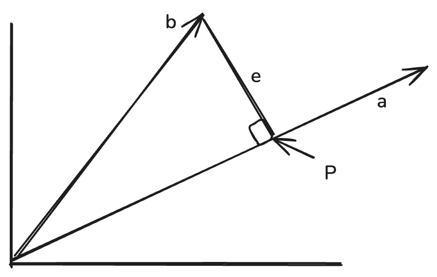
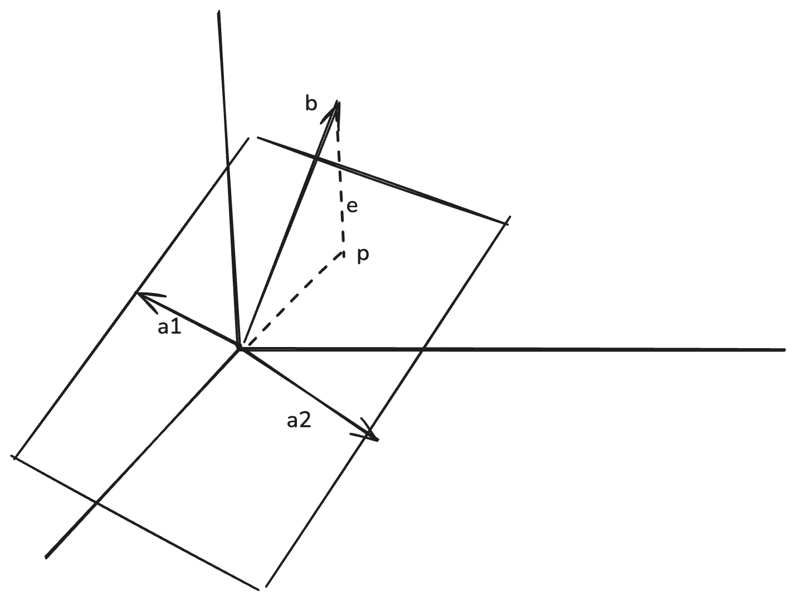

# Lecture 15: Projection onto Subspaces

**Video Lecture**: [MIT 18.06 Lecture 15 - Projections onto Subspaces](https://www.youtube.com/watch?v=Y_Ac6KiQ1t0&list=PL221E2BBF13BECF6C&index=31)

---

## 1. Projection of a Vector onto a Line

**Setup**: Project vector $b$ onto vector $a$.

**Key equations**:

$$
\begin{aligned}
p &= xa \\
a^T(b - xa) &= 0 \\
a^T b &= xa^T a \\
x &= \frac{a^T b}{a^T a}
\end{aligned}
$$

**Components**:
- $p$: Projection of $b$ onto $a$
- $e$: Error vector ($e = b - p$)
- $e \perp a$ (error is perpendicular to $a$)
- $p + e = b$
- $p = b - e$

**Projection formula**:

$$
p = a\frac{a^T b}{a^T a}
$$

**Properties**:
- If $b$ is doubled, then $p$ is doubled
- If $a$ is doubled, then $p$ does not change at all

---

## 2. Projection Matrix

**Matrix form**:

$$
p = Pb
$$

where

$$
P = \frac{aa^T}{a^T a}
$$

**Analysis**:
- $aa^T$ is $(n \times 1)(1 \times n) = n \times n$
- $a^T a$ is a scalar
- $P$ is $n \times n$
- Column space of $P$ is the line through $a$
- Rank is 1
- $P$ is symmetric: $P^T = P$
- $P^2 = P$ (if I project twice, the result is the same)

---

## 3. Why Projection?

**Problem**: The equation $Ax = b$ may have 0 solutions when $m > n$.

**Solution**: Solve $A\hat{x} = p$ instead, where $p$ is the projection of $b$ onto the column space.

**Setup**:
- $e = b - p$ is perpendicular to the plane (spanned by $a_1$ and $a_2$)
- $A = \begin{bmatrix}| & | \\ a_1 & a_2 \\ | & |\end{bmatrix}$
- $p = \hat{x}_1 a_1 + \hat{x}_2 a_2 = A\hat{x}$

---

## 4. Finding $\hat{x}$

**Key idea**: $b - A\hat{x} \perp C(A)$ (error is perpendicular to column space)

**Derivation**: Error $e$ is perpendicular to $a_1$ and $a_2$:

$$
\begin{aligned}
a_1^T(b - A\hat{x}) &= 0 \text{ and } a_2^T(b - A\hat{x}) = 0 \\
\begin{bmatrix}a_1^T \\ a_2^T\end{bmatrix}(b - A\hat{x}) &= \begin{bmatrix}0 \\ 0\end{bmatrix} \\
A^T(b - A\hat{x}) &= \mathbf{0}
\end{aligned}
$$

**Key relationships**:
- $e = b - A\hat{x}$ is in the left null space
- $e \in N(A^T)$
- $e \perp C(A)$ (error is perpendicular to column space of $A$)

**Normal equations**:

$$
A^T b = A^T A\hat{x}
$$

**Solution**:

$$
\hat{x} = (A^T A)^{-1} A^T b
$$

**Projection**:

$$
p = A\hat{x} = A(A^T A)^{-1} A^T b
$$

**Projection matrix**:

$$
P = A(A^T A)^{-1} A^T
$$

**Special case**: If $A$ is invertible, then $P = I$ (identity matrix).

**Properties in high dimensions**:
- $P^T = P$ (symmetric)
- $P^2 = P$ (idempotent)

---

## 5. Least Squares Application

**Problem**: Fit a line $y = c + dt$ to data points $(1,1)$, $(2,2)$, and $(3,3)$.

**Setup**:

$$
A = \begin{bmatrix}
1 & 1 \\
1 & 2 \\
1 & 3
\end{bmatrix}, \quad
b = \begin{bmatrix}
1 \\
2 \\
3
\end{bmatrix}, \quad
x = \begin{bmatrix}
c \\
d
\end{bmatrix}
$$

**Equation system**: $Ax = b$
- Row 1: $c + 1 \cdot d = 1$
- Row 2: $c + 2 \cdot d = 2$
- Row 3: $c + 3 \cdot d = 3$

**Issue**: Cannot find exact solution for $x$ because:
- $A$ is not invertible (not square: $3 \times 2$)
- System is overdetermined (3 equations, 2 unknowns)

**Solution**: Use projection to find $\hat{x}$ that minimizes $\|Ax - b\|^2$.

---

## 6. Geometric Interpretation

**3 Lines in 3D**: If we have 3 lines in 3-dimensional space, then $A$ will be square.

**If $A$ is invertible** (full rank):
- $Ax = b$ has an exact solution
- The solution geometrically means: find the plane spanned by column 1 and column 2, then find where column 3 crosses it

---

*Source: MIT 18.06SC Linear Algebra, Lecture 15*
