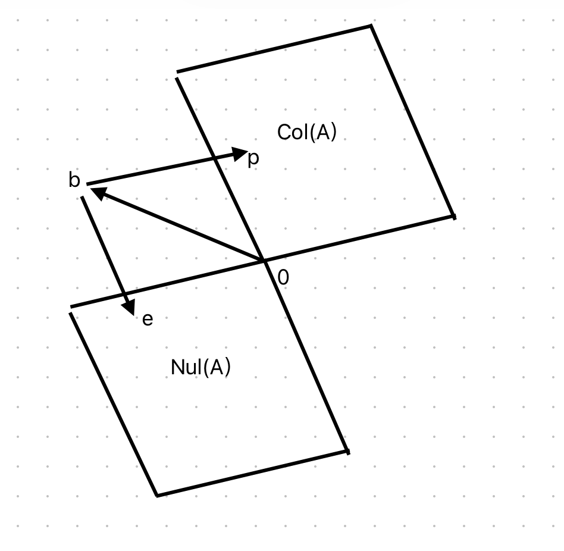
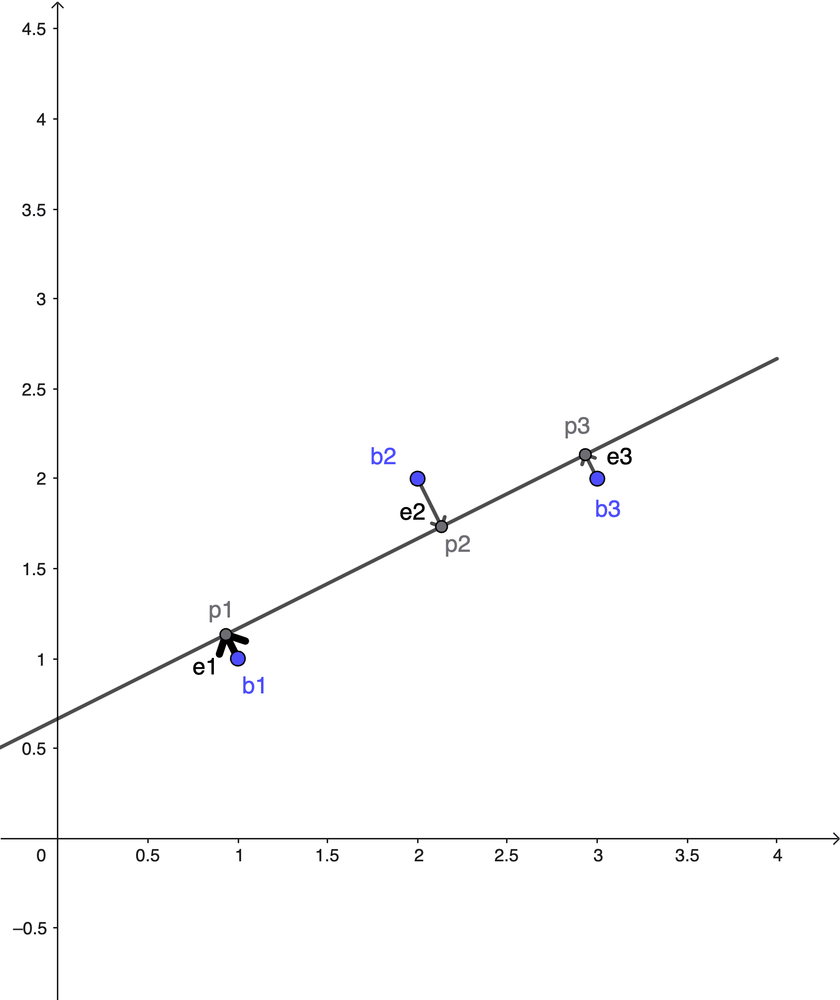
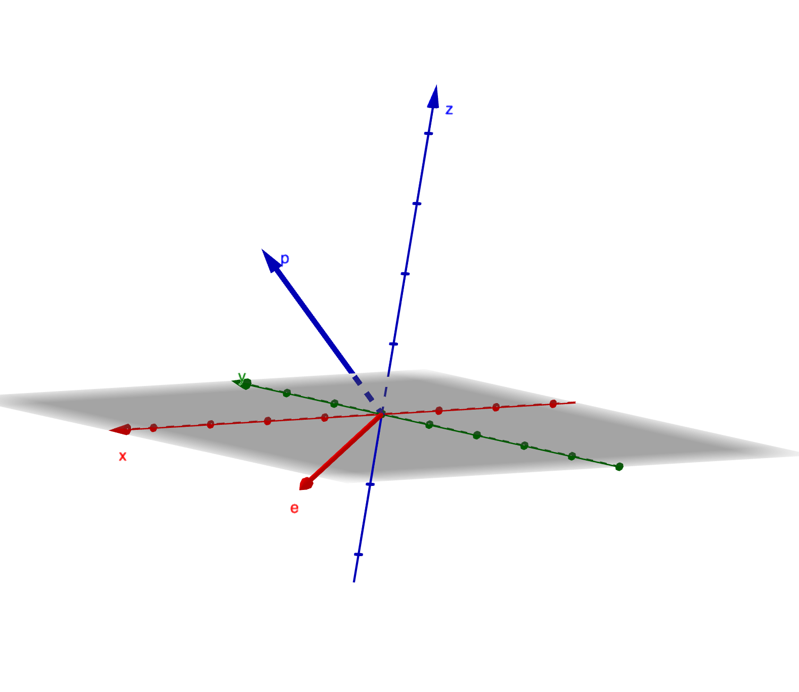
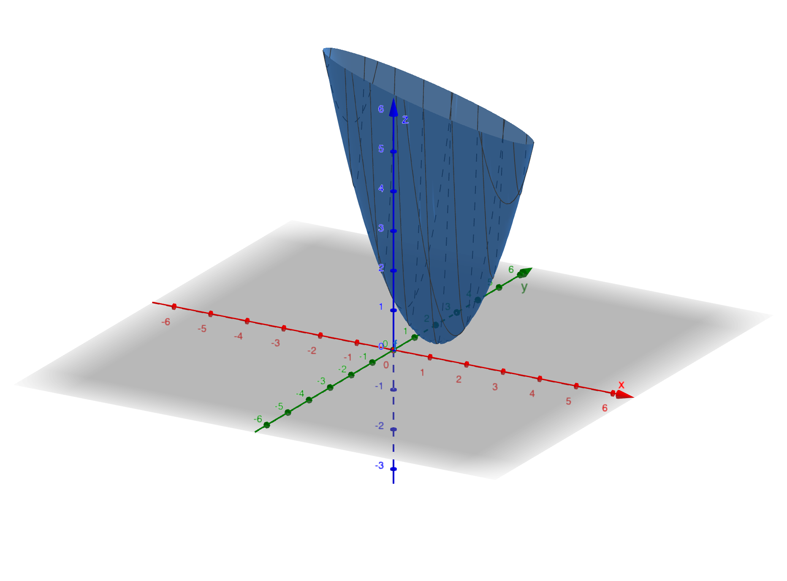

# Lecture 16: Projection Matrices and Least Square

**Video**: [MIT 18.06 Lecture 16](https://www.youtube.com/watch?v=osh80YCg_GM&list=PL221E2BBF13BECF6C&index=35)

## Projection Matrix
The projection matrix P projects any vector b onto the column space of A.

$$
P=A(A^\top A)^{-1}A^\top
$$

- If b is in the column space, $Pb=b$
- If b is perpendicular to the column space, $Pb=0$

$$
p+e=b
$$

$$
Pb=p \\
e=(I-P)b
$$

- p is in the column space
- e is in the left null space

This decomposition shows that any vector b can be split into its projection p and error e, which are orthogonal.

## Least Square
When Ax=b has no solution, least squares finds the x that minimizes the error ||Ax-b||.

- b1, b2, b3 are not on the same line, so we cannot solve Ax=b exactly
- p1, p2, p3 are on the same line, so we can find the best fit line

$$
\arg\min||Ax-b||^2=\\
e_1^2+e_2^2+e_3^2
$$

$$
C+D=1\\
C+2D=2\\
C+3D=2
$$

This is the equation $Ax=b$

$$
\begin{bmatrix}1&1\\1&2\\1&3\end{bmatrix} \begin{bmatrix}C\\D\end{bmatrix}=\begin{bmatrix}1\\2\\2\end{bmatrix}
$$

## Find P
- Find $\hat{x}=\begin{bmatrix}\hat{C}\\\hat{D}\end{bmatrix}$, the best fit line (not the perfect line)
- Find the projection P
- Normal equation:

$$
A^\top A\hat{x}=A^\top b
$$

This is called the normal equation because $A^\top(A\hat{x}-b)=0$ means the error is normal (perpendicular) to the column space.

- $A^\top A$

$$
\begin{bmatrix}1&1&1\\1&2&3\end{bmatrix}\begin{bmatrix}1&1\\1&2\\1&3\end{bmatrix} =\begin{bmatrix}3&6\\6&14\end{bmatrix}
$$

- $A^\top b$

$$
\begin{bmatrix}1&1&1\\1&2&3\end{bmatrix}\begin{bmatrix}1\\2\\2\end{bmatrix}=\begin{bmatrix}5\\11\end{bmatrix}
$$

- Equation

$$
3C+6D=5\\
6C+14D=11
$$

C=2/3, D=1/2

- Calculate projections and errors:
	- $p_1=\frac{2}{3}+\frac{1}{2}=\frac{7}{6}$
	- $p_2=\frac{2}{3}+1=\frac{5}{3}$
	- $p_3=\frac{2}{3}+\frac{3}{2}=\frac{13}{6}$
	- $e_1=1-\frac{7}{6}=-\frac{1}{6}$
	- $e_2=2-\frac{5}{3}=\frac{1}{3}$
	- $e_3=2-\frac{13}{6}=-\frac{1}{6}$
- Verify perpendicularity:
	- $p=[\frac{7}{6},\frac{5}{3},\frac{13}{6}]$
	- $e=[-\frac{1}{6},\frac{1}{3},-\frac{1}{6}]$

### Unit Vectors
This is a preview for the next lecture.
The vectors [0,0,1], [0,1,0], [1,0,0] are orthonormal unit vectors (perpendicular to each other with unit length).
If we arrange them as columns in matrix Q,

$$
Q^\top Q=I_n
$$

Another orthonormal matrix is the rotation matrix:

$$
\begin{bmatrix}\cos\theta&-\sin\theta\\\sin\theta &\cos\theta\end{bmatrix}
$$

- Proof that columns are unit vectors:
	- $(\cos\theta)^2+(\sin\theta)^2=1$
	- $(-\sin\theta)^2+(\cos\theta)^2=1$
- Proof of perpendicularity:
	- $q_1^\top q_2 = \cos\theta(-\sin\theta) + \sin\theta(\cos\theta) = 0$

## Find P from Calculus
From the error minimization perspective, we have the error function:

$$
(C+D-1)^2+(C+2D-2)^2+(C+3D-2)^2
$$

We can find the minimum by setting the gradient to zero for this positive definite matrix.
The professor briefly introduced this approach to show the connection between linear algebra and calculus.
