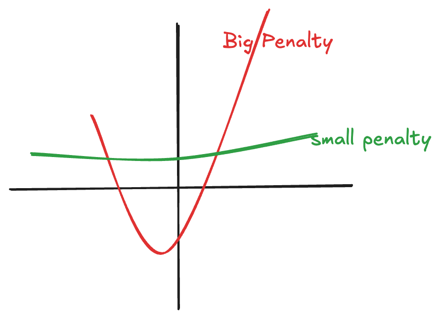

# 7.5 Noise Robustness

## Overview

Noise injection can be used as a **regularization technique** to improve model robustness and generalization. This section explores how adding random perturbations to weights leads to an effective regularization term.

---

## 1. Random Perturbation on Weights

### Original Error Function

The standard mean squared error:
$$
J = \mathbb{E}_{p(x,y)} \left[ (\hat{y}(x) - y)^2 \right]
$$

### Weight Noise Model

Add Gaussian noise to the weights:
$$
\epsilon_W \sim \mathcal{N}(0, \eta I)
$$

This is a **normal distribution** with:
- Mean: $0$
- Covariance: $\eta I$ (where $\eta$ controls the noise magnitude)

### Objective Function with Noisy Weights

Let $\hat{y}_{\epsilon_W}(x) = \hat{y}_{W + \epsilon_W}(x)$ denote the model output with perturbed weights.

The new objective becomes:
$$
\tilde{J}_W = \mathbb{E}_{p(x, y, \epsilon_W)} \left[ (\hat{y}_{\epsilon_W}(x) - y)^2 \right]
$$

**Formula 7.31**: This expectation is over the data distribution **and** the weight noise.

---

## 2. Deriving the Regularization Term

### Expanding the Squared Error

$$
\tilde{J} = \mathbb{E}_{p(x, y, \epsilon_W)} \left[ \hat{y}_{\epsilon_W}^2(x) - 2y \hat{y}_{\epsilon_W}(x) + y^2 \right]
$$

**Formula 7.32**

### Taylor Approximation

When $\eta$ is small, we can approximate:
$$
\hat{y}_{W + \epsilon_W}(x) \approx \hat{y}_W(x) + \epsilon_W^T \nabla_W \hat{y}_W(x)
$$

**Interpretation**: The change in output is approximately the **inner product** of the weight noise $\epsilon_W$ and the gradient $\nabla_W \hat{y}_W(x)$ — i.e., the noise projected onto the gradient direction.

### Simplification

Let:
- $a = \hat{y}_W(x) - y$ (prediction error)
- $b = \epsilon_W^T \nabla_W \hat{y}_W(x)$ (noise-induced perturbation)

Then:
$$
\tilde{J} = \mathbb{E}[a^2] + \mathbb{E}[2ab] + \mathbb{E}[b^2]
$$

**Key observations**:

1. **Cross-term vanishes**:
   $$
   \mathbb{E}[ab] = 0
   $$
   Because $\epsilon_W$ has zero mean and is independent of $a$.

2. **Noise variance contributes regularization**:
   $$
   \mathbb{E}[b^2] = \mathbb{E}\left[(\epsilon_W^T \nabla_W \hat{y}_W(x))^2\right]
   $$

Since $\epsilon_W \sim \mathcal{N}(0, \eta I)$:
$$
\mathbb{E}[b^2] = \eta ||\nabla_W \hat{y}_W(x)||^2
$$

**Derivation**: For a Gaussian random vector $\epsilon \sim \mathcal{N}(0, \sigma^2 I)$ and any vector $v$:
$$
\mathbb{E}[(\epsilon^T v)^2] = \sigma^2 ||v||^2
$$

---

## 3. Final Regularized Objective

Combining the terms:
$$
\tilde{J}(W; x, y) = J(W) + \eta \mathbb{E}_{p(x,y)} \left[ ||\nabla_W \hat{y}_W(x)||^2 \right]
$$

**Interpretation**:
- **First term**: Original loss function
- **Second term**: **Regularization penalty** proportional to the squared gradient norm

**Key insight**: Adding Gaussian noise to weights is equivalent to penalizing large gradients of the output with respect to the weights.

---

## 4. Geometric Interpretation

The regularization term $||\nabla_W \hat{y}_W(x)||^2$ measures how **sensitive** the output is to weight perturbations.

**What this encourages**:
- **Flat minima**: Solutions where small weight changes don't dramatically affect predictions
- **Robust features**: The model relies on stable patterns rather than fine-grained weight configurations
- **Generalization**: Prevents overfitting to exact weight values

---

## 5. Injecting Noise at the Output Targets

### Label Smoothing

Instead of using hard 0/1 targets, **label smoothing** softens the target distribution:

$$
y'_k =
\begin{cases}
1 - \varepsilon, & \text{if } k \text{ is the correct class} \\
\varepsilon / (K - 1), & \text{otherwise}
\end{cases}
$$

where:
- $K$ is the number of classes
- $\varepsilon$ is the smoothing parameter (typically 0.1)

**Example**: For 3-class classification with correct class = 1 and $\varepsilon = 0.1$:
- Original: $[0, 1, 0]$
- Smoothed: $[0.05, 0.9, 0.05]$

### Benefits

1. **Prevents overconfidence**: The model doesn't push probabilities to exact 0 or 1
2. **Improves calibration**: Predicted probabilities better reflect true uncertainty
3. **Regularization effect**: Acts as implicit regularization on the output layer

**Interpretation**: Label smoothing can be viewed as injecting small noise into the target distribution, making the model **less overconfident** and more robust.

---

*Source: Deep Learning Book, Chapter 7.5*
