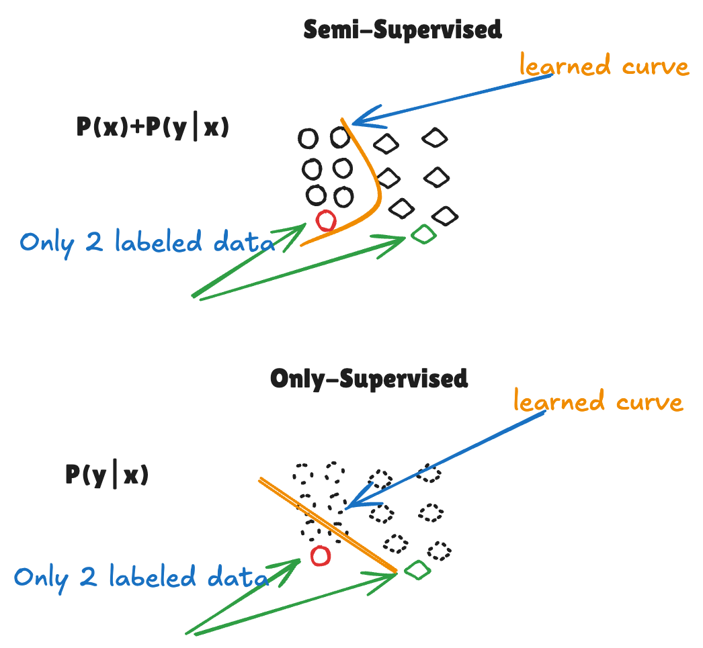

# 7.6 Semi-Supervised Learning

## Overview

When labeled data is scarce, **semi-supervised learning** leverages both labeled and unlabeled data to improve model performance. This approach combines:
1. **Generative modeling** to learn data distribution $P(x)$
2. **Supervised classification** to learn $P(y|x)$
3. **Joint optimization** that balances both objectives

---

## 1. The Problem: Limited Labeled Data

In many real-world scenarios:
- Labeled data is **expensive** to obtain (requires human annotation)
- Unlabeled data is **abundant** and cheap
- Models trained only on limited labeled data tend to overfit

**Solution**: Use unlabeled data to learn better representations and regularize the model.

---

## 2. Two Learning Objectives

### Generative Model (Unsupervised)

**Objective**: Maximize the probability of generating correct inputs
$$
P(x)
$$

**What this learns**:
- The underlying distribution of the data
- Useful representations of the input space
- Structure and patterns in unlabeled data

### Classification Model (Supervised)

**Objective**: Maximize the probability of correct predictions given inputs
$$
P(y|x)
$$

**What this learns**:
- Decision boundaries between classes
- Task-specific features
- Direct mapping from inputs to labels

---

## 3. Joint Learning Objective

**Combined loss function**:
$$
\mathcal{L} = -\log P(y|x) - \lambda \log P(x)
$$

where:
- First term: **Supervised loss** (classification accuracy)
- Second term: **Unsupervised loss** (generative modeling)
- $\lambda$: **Trade-off parameter** controlling the balance

**Interpretation**:
- The model must simultaneously:
  1. Predict labels correctly (supervised term)
  2. Model the data distribution well (unsupervised term)
- The unsupervised term acts as **regularization**, preventing overfitting to the small labeled set

---

## 4. Why This Works

**Key insight**: When the model learns how to represent $P(x)$, it discovers where the data is dense. Decision boundaries should avoid cutting through high-density regions — they should instead pass through low-density areas between clusters.

**Geometric interpretation**:
- Learning $P(x)$ reveals the natural clustering structure of the data
- Classification boundaries are encouraged to lie in low-density regions
- This prevents the decision boundary from crossing through dense data manifolds

**Benefits**:
1. **Better representations**: Unlabeled data reveals the structure of the input space
2. **Cluster assumption**: Decision boundaries naturally form between clusters, not through them
3. **Regularization**: The generative term prevents the classifier from focusing only on labeled examples
4. **Data efficiency**: Can achieve high accuracy with significantly fewer labeled samples

**Example**:
- With only 10% labeled data, semi-supervised learning can match the performance of fully supervised learning with 100% labels

---

## 5. Real-World Applications

**Note**: The following table is generated by ChatGPT.

| Domain | Task / Problem | Unlabeled Data Used | Method Family | Real-World Benefit | Reference |
|--------|----------------|---------------------|---------------|-------------------|-----------|
| **Image Recognition** | Classifying natural images (CIFAR-10, ImageNet-100) | Millions of unlabeled web images | Consistency Regularization (FixMatch, Mean Teacher) | +15–25% accuracy with 10× fewer labeled samples | Sohn et al., *FixMatch*, 2020 |
| **Medical Imaging** | Tumor or lesion segmentation (MRI / CT) | Thousands of unlabeled scans | Generative / Consistency Hybrid (VAE, U-Net) | ~80% annotation cost reduction; works well with rare cases | Bai et al., *MedIA*, 2019 |
| **Speech Recognition** | Automatic speech recognition (ASR) | Large amounts of raw audio | Representation Learning (wav2vec 2.0) | Matches full supervision using <10% labeled data | Baevski et al., *wav2vec 2.0*, 2020 |
| **Natural Language Processing** | Text classification, sentiment analysis | Billions of unlabeled sentences | Self-Supervised Pretraining (BERT, RoBERTa) | Massive improvement in downstream $P(y \mid x)$ tasks | Devlin et al., *BERT*, 2018 |
| **Autonomous Driving** | Scene understanding, lane detection | Continuous unlabeled video streams | Consistency + Pseudo-Labeling | Robust to lighting/weather; reduces manual labels | French et al., 2020 |
| **Financial Fraud Detection** | Detecting anomalous transactions | Transaction logs without labels | Generative Modeling (VAE / GAN) | Learns normal patterns → better anomaly detection | Xu et al., *KDD*, 2018 |
| **Recommendation Systems** | Predicting user preferences | User–item logs without explicit feedback | Representation Learning (Autoencoder / Contrastive) | Improves cold-start and leverages implicit signals | — |

---

## 6. Common Semi-Supervised Learning Methods

**Note**: The following content is generated by ChatGPT.

### Consistency Regularization
- **Idea**: Model should produce similar predictions for perturbed versions of the same input
- **Examples**: FixMatch, Mean Teacher, Virtual Adversarial Training

### Pseudo-Labeling
- **Idea**: Use model's confident predictions on unlabeled data as "soft labels"
- **Process**: Train → predict on unlabeled → retrain with pseudo-labels

### Generative Models
- **Idea**: Learn $P(x)$ and $P(y|x)$ jointly
- **Examples**: VAE, GAN-based approaches

### Self-Supervised Pretraining
- **Idea**: Pretrain on unlabeled data with pretext tasks, then fine-tune on labeled data
- **Examples**: BERT (masked language modeling), wav2vec 2.0 (contrastive learning)

---

*Source: Deep Learning Book, Chapter 7.6*
