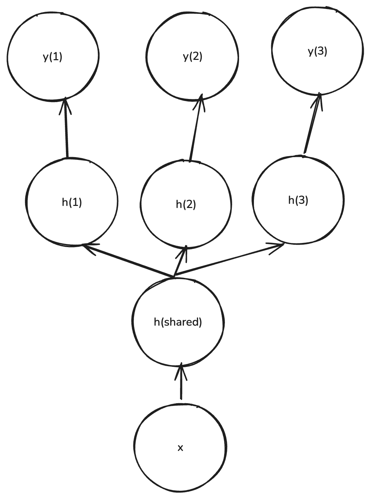

# 7.7 Multi-Task Learning

## Overview

**Multi-task learning** trains a single model to perform multiple related tasks simultaneously by sharing representations across tasks. This approach:
1. Improves generalization by learning shared features
2. Reduces overfitting through implicit regularization
3. Enables knowledge transfer between related tasks

---

## 1. Concept

### Model Architecture

Multi-task learning uses a **shared representation** with **task-specific outputs**:

**Training**:
$$
\begin{aligned}
h &= f(x; \theta_{\text{shared}}) \\
\hat{y}^{(t)} &= g(h; \theta_t)
\end{aligned}
$$

where:
- $h$: **Shared representation** (common features learned across all tasks)
- $f(x; \theta_{\text{shared}})$: **Shared layers** (e.g., CNN encoder, Transformer)
- $g(h; \theta_t)$: **Task-specific head** for task $t$
- $\theta_{\text{shared}}$: Shared parameters
- $\theta_t$: Task-specific parameters

### Loss Function

**Combined loss**:
$$
\mathcal{L} = \sum_t \lambda_t \mathcal{L}_t(g(f(x; \theta_{\text{shared}}); \theta_t))
$$

where:
- $\mathcal{L}_t$: Loss function for task $t$
- $\lambda_t$: **Weight** for task $t$ (controls importance)
- Sum is over all tasks

**Interpretation**: The model minimizes a weighted combination of task-specific losses, forcing the shared representation to be useful for all tasks.

---

## 2. Benefit

**Multi-task learning improves generalization ability and reduces generalization error.**

**Why this works**:

1. **Shared representations**: Common features learned from multiple tasks are more robust and general
2. **Implicit regularization**: Training on multiple tasks prevents overfitting to any single task
3. **Data efficiency**: Each task benefits from the data of other tasks
4. **Inductive bias**: The model is encouraged to learn features that are useful across tasks

**Example**:
- Training on both face recognition and age estimation helps the model learn better facial features than training on either task alone
- The shared features capture general facial characteristics useful for both tasks

---

## 3. Limitation

**Multi-task learning works only when the assumption that the tasks are related statistically holds.**

**When it fails**:
- **Unrelated tasks**: If tasks are not related, sharing representations can hurt performance
- **Negative transfer**: A poorly performing task can degrade the shared representation
- **Task interference**: Conflicting objectives can prevent convergence

**Examples of unrelated tasks**:
- Face recognition + financial fraud detection (no shared structure)
- Medical diagnosis + game playing (different domains entirely)

**Key principle**: Tasks should share some underlying structure or statistical properties for multi-task learning to be beneficial.

---

## 4. Real-World Cases

**Note**: The following table is generated by ChatGPT.

| Domain | Tasks Learned Together | Shared Representation / Model | Practical Benefit | Example / Source |
|--------|------------------------|-------------------------------|-------------------|------------------|
| **Face Analysis** | Face recognition · Age estimation · Gender / Emotion classification | Shared CNN backbone (e.g., ResNet) with multiple output heads | Improves accuracy and robustness by using shared facial features | Zhang et al., *MTL-CNN for Face Analysis*, CVPR 2014 |
| **Autonomous Driving** | Object detection · Lane segmentation · Depth estimation | Shared encoder in perception network | Enables one network to handle multiple perception tasks → reduced compute & latency | Uber ATG, *MultiNet*, CVPR 2017 |
| **Medical Imaging** | Tumor segmentation · Disease classification | Shared U-Net encoder with task-specific decoders | Combines fine-grained segmentation and diagnosis → less labeled data needed | Liu et al., *MT-UNet*, MICCAI 2019 |
| **Speech Processing** | Phoneme recognition · Speaker ID · Emotion detection | Shared acoustic encoder (e.g., wav2vec backbone) | Improves noise robustness and transfer learning across tasks | Baevski et al., *wav2vec 2.0*, 2020 |
| **Natural Language Processing** | POS tagging · NER · Parsing · Sentiment analysis | Shared Transformer encoder (e.g., BERT) with task-specific heads | Learns richer linguistic features; boosts low-data tasks | Collobert et al., *Unified NLP with MTL*, 2008; Devlin et al., *BERT*, 2019 |
| **Search & Recommendation** | Click prediction · Conversion rate · Dwell-time estimation | Shared user-embedding network | Captures user intent across tasks → higher CTR and ranking precision | Google Ads / YouTube Recommender Systems |
| **Financial Risk Modeling** | Credit default · Fraud detection · Customer churn | Shared behavior-feature extractor | Reduces training cost, improves detection of rare events | Ant Financial Research Team, 2020 |
| **Robotics / Reinforcement Learning** | Navigation · Object manipulation · Balance control | Shared policy network or shared latent state | Learns transferable motor skills across tasks | DeepMind IMPALA (2018), Gato (2022) |

---

*Source: Deep Learning Book, Chapter 7.7*
